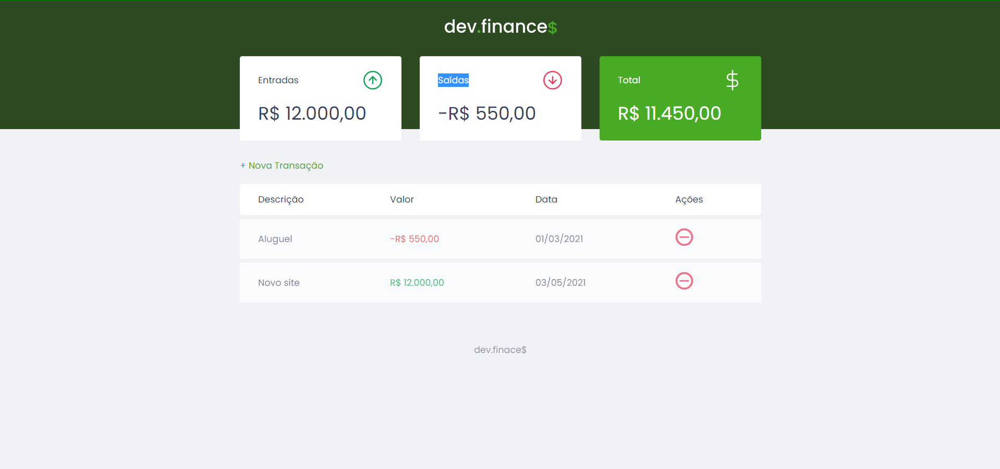

<!-- 

  

 -->

  
  
  

## 📓 Resumo

- [Sobre o projeto](#sobre-o-projeto)
- [Overview](#overview)
- [Techs](#techs)
- [Feito por](#feito-por)
- [License](#license)

## ❓ Sobre o projeto

Aplicação criada o evento **Maratona Discover** na sua 1° edição, oferecido pela **Rockeseat**. O projeto visa a implementação de uma website que facilite o controle finaceiro do usuário. Que tal ter o controle das suas finanças?

## 🚀 Overview

  

## 🛠️ Techs

<table>
  <tr>
    <td>
      
    </td>
  </tr>
  <tr>
    <td>
      
    </td>
  </tr>
  <tr>
    <td>
      
    </td>
  </tr>
</table>

 

## 👨‍💻 Feito por

<table>
  <tr>
    <td align="center"> <b><a href="https://linkedin.com/in/lucianoweslen11" title="Luciano">Luciano W. da Silva</a></b> Desenvolvedor Web</td>
  </tr>
</table>

## 📜 License

O projeto está sobre a licença [MIT](./LICENSE)

 

🧡
